# Geographical Analysis and Prediction of Chicago Crime

This project focuses on analyzing and predicting crime in Chicago based on geographical and temporal data. By leveraging machine learning techniques such as decision trees, random forests, and K-Nearest Neighbors (KNN), the project aims to enhance public safety by predicting crime occurrences based on time, location, and other factors. For a more detailed analysis and discussion, please refer to the [full project report](Full_Report.pdf).

## Table of Contents
1. [Introduction](#introduction)
2. [Project Structure](#project-structure)
3. [Datasets](#datasets)
4. [Data Processing](#data-processing)
5. [Exploratory Data Analysis (EDA)](#exploratory-data-analysis-eda)
    - [Data Visualization](#data-visualization)
6. [Machine Learning Models](#machine-learning-models)
    - [Feature Selection](#feature-selection)
    - [Decision Tree](#decision-tree)
    - [Random Forest](#random-forest)
    - [K-Nearest Neighbor](#k-nearest-neighbor)
7. [Sampling Techniques](#sampling-techniques)
8. [Dimensionality Reduction: PCA](#dimensionality-reduction-pca)
9. [Model Performance](#model-performance)
10. [Application – Predictions for 2024](#application--predictions-for-2024)
11. [Future Work](#future-work)
12. [References](#references)

## Introduction
Crime is a persistent social issue that affects public safety and socio-economic well-being. Inspired by real-world events, this project aims to analyze crime trends in Chicago based on time and location, and predict future crime occurrences using machine learning techniques. The goal is to assist law enforcement in making informed decisions and improving public safety.

## Project Structure
The project is divided into several components:
- **Data Preprocessing**: Handling missing values, filtering irrelevant features, and reclassifying crime types.
- **Exploratory Data Analysis (EDA)**: Visualizing crime patterns based on time, location, and type.
- **Modeling**: Implementing machine learning models (Decision Tree, Random Forest, KNN) for crime prediction.
- **Evaluation**: Using metrics like accuracy, F1-score, and ROC-AUC to evaluate the models.
- **Prediction**: Forecasting crime types for the year 2024 during major events in Chicago.

## Datasets
The project uses crime data from Chicago, spanning from 2001 to 2024. This dataset includes around 8 million incidents with variables like date, type, description, location, etc.

- **Source**: [Chicago Crime Data](https://data.cityofchicago.org/Public-Safety/Crimes-2001-to-Present/ijzp-q8t2/about_data)

## Data Processing
1. **Handling Missing Data**: Less than 1% missing values were removed.
2. **Feature Selection**: Relevant features like crime type, location (latitude and longitude), and time were retained for modeling.
3. **Crime Classification**: Crimes were reclassified into two categories (UCR Part I and Part II) using the IUCR codes.

**Table 1**: Overview of the dataset after preprocessing:

| Block          | Primary Type | District | Ward | Community Area | Year | Latitude | Longitude | UCR Part | Month | Day | Time | Weekday |
|----------------|--------------|----------|------|----------------|------|----------|-----------|----------|-------|-----|------|---------|
| XXX BLOCK A    | Theft        | 12       | 24   | Area 1         | 2020 | 41.8781  | -87.6298  | Part I   | 7     | 14  | Afternoon | Wednesday |
| XXX BLOCK B    | Assault      | 5        | 12   | Area 5         | 2022 | 41.8781  | -87.6298  | Part II  | 9     | 8   | Late Morning | Monday |
| ...            | ...          | ...      | ...  | ...            | ...  | ...      | ...       | ...      | ...   | ... | ...  | ...     |

## Exploratory Data Analysis (EDA)

The Exploratory Data Analysis was performed using Python for data manipulation and ggplot2 in R for visualization. The data was analyzed to identify patterns in crime types, their distribution across time and location.

### Data Visualization
Several visualizations were generated to better understand crime trends:

- **Crimes by Year**: Crimes in UCR Part I are significantly higher than in Part II across the years. There is a noticeable dip in 2020 and 2021, potentially due to the pandemic.

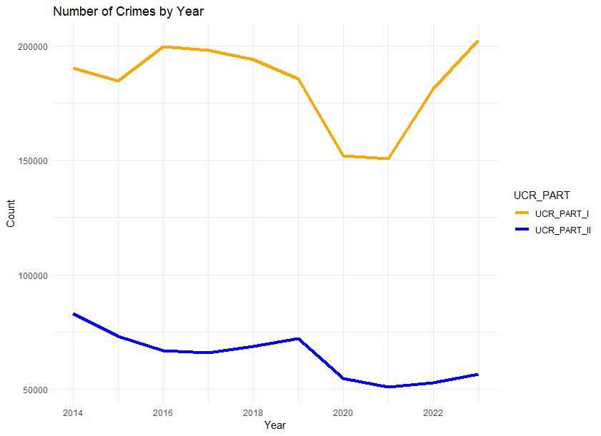

- **Crimes by Month**: UCR Part I crimes peak in July and August, making them the most unsafe months.

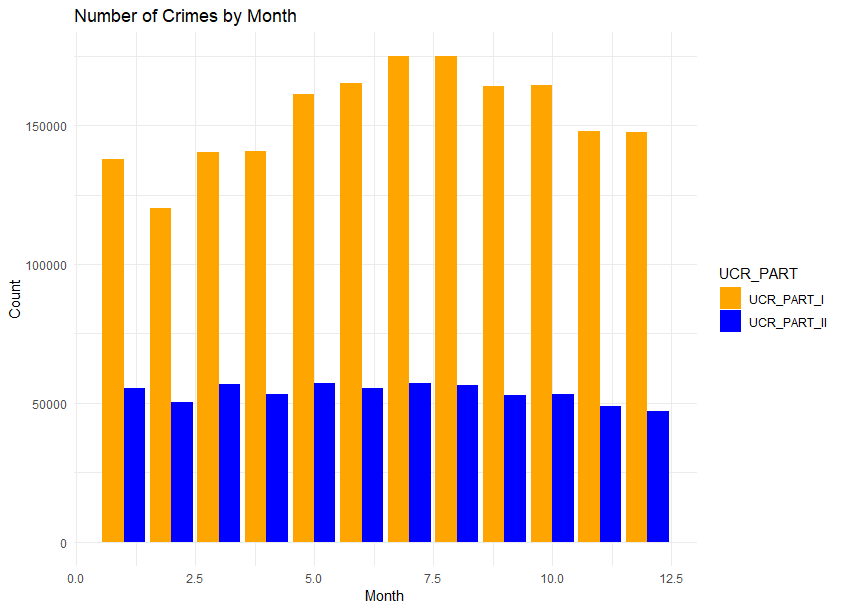

- **Crimes by Time of Day**: UCR Part I crimes are most frequent in the afternoon, while UCR Part II crimes peak in the late morning.

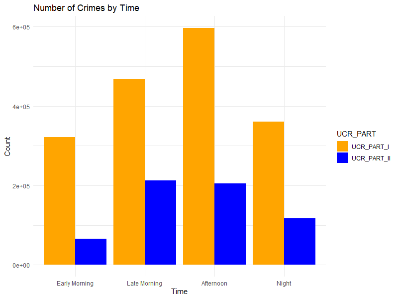

- **Crime Types**: Theft is the most common crime in UCR Part I, while deceptive practices dominate UCR Part II.

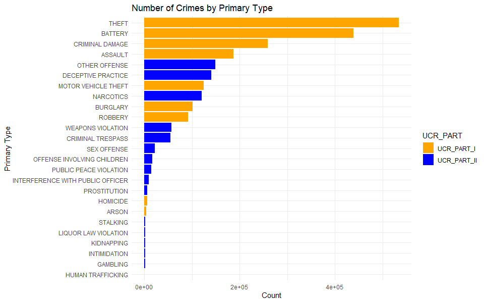

- **Geospatial Visualization**: Crimes are distributed throughout Chicago, with the northwest side of District 16 showing fewer incidents.

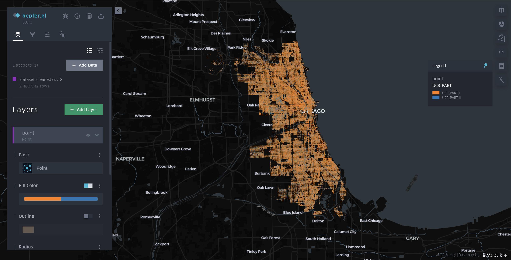

## Machine Learning Models

### Feature Selection
To extract the information from the dataset, I first calculated the importance of the features using the “ExtraTreesClassifier”. We can see that the features "District" and "Community Area" are much less important than the other features. Considering that there is more than one area division criterion and spatial features in the data (e.g., District, Community Area, Latitude, and Longitude), I extracted these features and fitted decision trees on them to assess their significance. The results (Table 2) show that while the accuracy of the separate models based on “District” and “Community Area” is reasonably decent, their F1-scores are not as high as the models based on Latitude and Longitude. Since "District" and "Community Area" are defined by different latitude and longitude, including them all in the model would lead to multicollinearity. After considering this, I decided to choose the final features as “Latitude,” “Longitude,” “Year,” “Month,” “Day,” “Weekday,” and “Time.”

- **Importance of the features in “ExtraTreesClassifier”:**

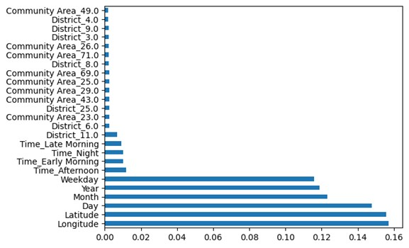

**Table 2**: Importance of the features in tree-based models  

| Features | Time Data Based (Decision Tree) | Spatial Data Based (Decision Tree) |  
|----------------|----------|---------|  
| Year, Month, Weekday, Day, Time | 72.85% (Accuracy) | 68.88% (F1-Score) |  
| District | 74.06% (Accuracy) | 63.03% (F1-Score) |  
| Community Area | 74.06% (Accuracy) | 63.02% (F1-Score) |  
| Latitude, Longitude | 72.85% (Accuracy) | 68.88% (F1-Score) |  

### Decision Tree
A decision tree model was trained on selected features (e.g., time, location). The first 4 layers of this model are shown below.

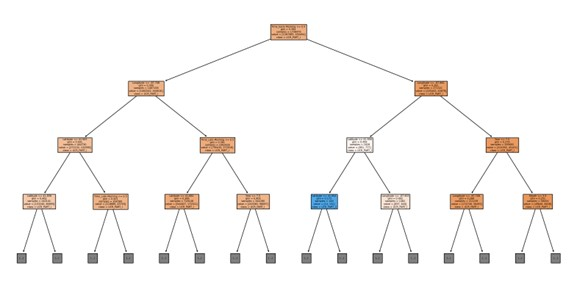

**Model Results**:
- **Accuracy**: 64.57%
- **F1-Score**: 64.89%

### Random Forest
Random Forest, with optimized hyperparameters, outperformed the decision tree model.

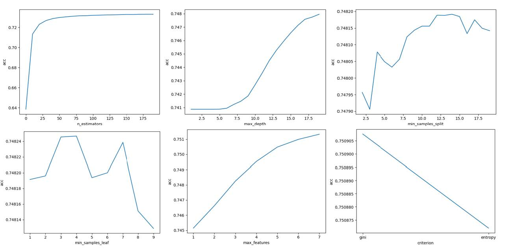

**Optimal Hyperparameters**:
- n_estimators: 181
- max_depth: 19
- min_samples_split: 14
- min_samples_leaf: 4
- max_features: 7
- criterion: gini

**Model Results**:
- **Accuracy**: 75.23%
- **F1-Score**: 67.31%

### K-Nearest Neighbor (KNN)
KNN was also explored and optimized using the Elbow Method.

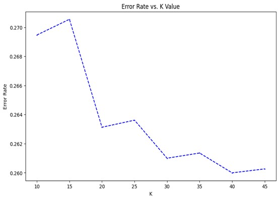

**Model Results**:
- **Accuracy**: 73.69%
- **F1-Score**: 65.05%

## Sampling Techniques
To handle the imbalanced dataset, oversampling and undersampling techniques were applied. However, neither technique significantly improved model performance.

**Table 3**: Results of Different Sampling Techniques:

| Sampling Method | Accuracy   | F1-Score  |
|-----------------|------------|-----------|
| No Sampling     | 73.38%     | 68.12%    |
| Random Undersampling | 60.55% | 62.92%    |
| SMOTE Oversampling | 64.84%  | 66.36%    |
| Random Oversampling | 62.62%  | 64.52%    |

## Dimensionality Reduction: PCA
Principal Component Analysis (PCA) was used to reduce data dimensionality. However, the models trained on PCA-reduced data did not show improvement over the models trained without PCA.

- **Scatter plot of principal component 1 vs. principal component 2:**

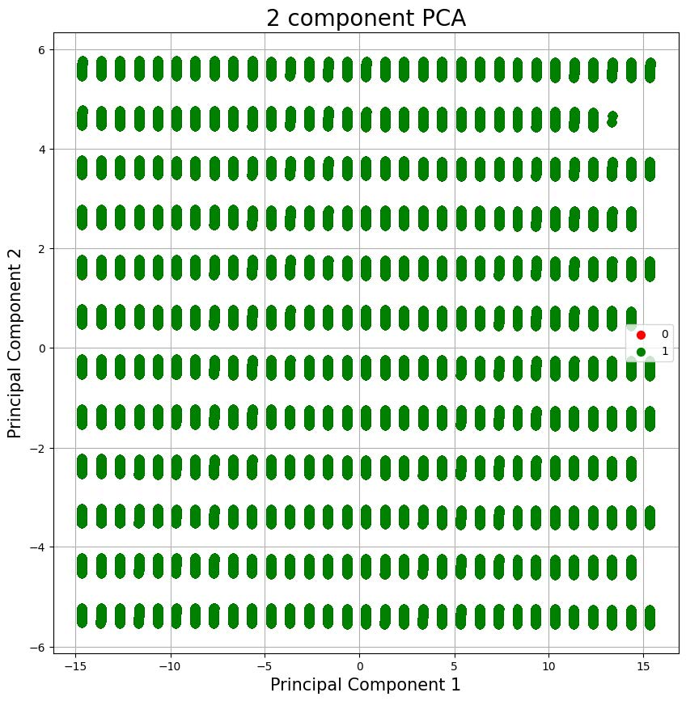

**Table 4**: Model Performance With and Without PCA:

| Model              | Accuracy Without PCA | Accuracy With PCA | F1-Score Without PCA | F1-Score With PCA |
|--------------------|----------------------|-------------------|----------------------|-------------------|
| Decision Tree      | 64.57%               | 64.04%            | 64.89%               | 63.91%            |
| Random Forest      | 73.38%               | 67.02%            | 68.12%               | 65.51%            |

## Model Performance
After comparing the models, the Random Forest model demonstrated the best overall performance.

- **ROC curves of different models:**

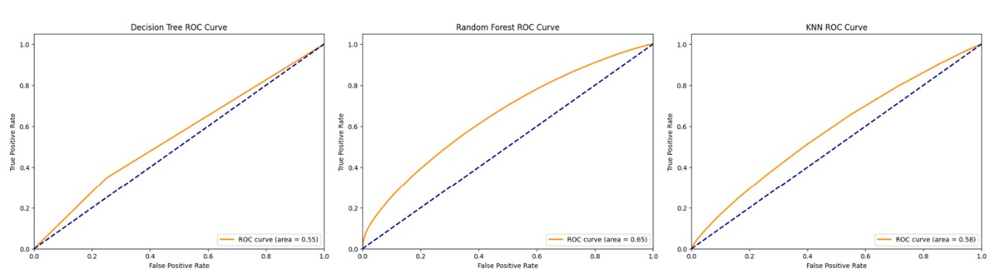

**Table 5**: Model Performance Summary:

| Model          | Accuracy  | F1-Score |
|----------------|-----------|----------|
| Decision Tree  | 64.57%    | 64.89%   |
| Random Forest  | 75.23%    | 67.31%   |
| KNN            | 73.69%    | 65.05%   |

## Application – Predictions for 2024

In this section, crime predictions for various large-scale events happening in Chicago in 2024 were made using the Random Forest model, which showed the best performance. Predictions were made for different time periods of the day, with results helping local authorities take preventive measures.

**Table 6**: International Events and Predicted Crime Types for 2024:

| Activity Name                                      | Latitude | Longitude | Month | Day | Weekday   | Time         | Predicted UCR Part |
|---------------------------------------------------|----------|-----------|-------|-----|-----------|--------------|-------------------|
| Chicago Auto Show 2024                            | 41.88323 | -87.6324  | 2     | 10  | Saturday  | Early Morning | UCR Part I         |
| Chicago Auto Show 2024                            | 41.88323 | -87.6324  | 2     | 10  | Saturday  | Late Morning  | UCR Part I         |
| Chicago Auto Show 2024                            | 41.88323 | -87.6324  | 2     | 10  | Saturday  | Afternoon     | UCR Part I         |
| Chicago Auto Show 2024                            | 41.88323 | -87.6324  | 2     | 10  | Saturday  | Night         | UCR Part I         |
| Expo Chicago 2024                                 | 41.8914  | -87.5997  | 4     | 11  | Thursday  | Early Morning | UCR Part I         |
| Expo Chicago 2024                                 | 41.8914  | -87.5997  | 4     | 11  | Thursday  | Late Morning  | UCR Part I         |
| Expo Chicago 2024                                 | 41.8914  | -87.5997  | 4     | 11  | Thursday  | Afternoon     | UCR Part I         |
| Expo Chicago 2024                                 | 41.8914  | -87.5997  | 4     | 11  | Thursday  | Night         | UCR Part I         |
| 2024 Chicago International Music Competition Final | 41.8762  | -87.6254  | 7     | 17  | Wednesday | Early Morning | UCR Part I         |
| 2024 Chicago International Music Competition Final | 41.8762  | -87.6254  | 7     | 17  | Wednesday | Late Morning  | UCR Part I         |
| 2024 Chicago International Music Competition Final | 41.8762  | -87.6254  | 7     | 17  | Wednesday | Afternoon     | UCR Part I         |
| 2024 Chicago International Music Competition Final | 41.8762  | -87.6254  | 7     | 17  | Wednesday | Night         | UCR Part I         |

Based on the model's prediction, the events are likely to experience UCR Part I crimes, which are more serious. Authorities should focus on preventive measures during these events, especially in crowded and high-risk areas.

## Future Work
- **Additional Features**: Incorporating demographic, economic, and weather data could improve the prediction accuracy.
- **Deep Learning**: Applying neural networks with optimized hyperparameters could lead to better results.
- **Dataset Expansion**: Expanding the dataset with more features would provide more context for predictions.

## References
1. Sharma, A., & Singh, D. (2021). Machine learning-based analytical approach for geographical analysis and prediction of Boston City crime using geospatial dataset. *Geojournal*. [DOI: 10.1007/s10708-021-10485-4](https://doi.org/10.1007/s10708-021-10485-4)
2. Hossain, S., et al. (2020). Crime Prediction Using Spatio-Temporal Data. *Communications in Computer and Information Science*. [DOI: 10.1007/978-981-15-6648-6_221](https://doi.org/10.1007/978-981-15-6648-6_221)
3. Yadav, S., et al. (2017). Crime pattern detection, analysis & prediction. *2017 International Conference of Electronics, Communication and Aerospace Technology (ICECA)*. [DOI: 10.1007/s10708-021-10485-4](https://doi.org/10.1007/s10708-021-10485-4)
